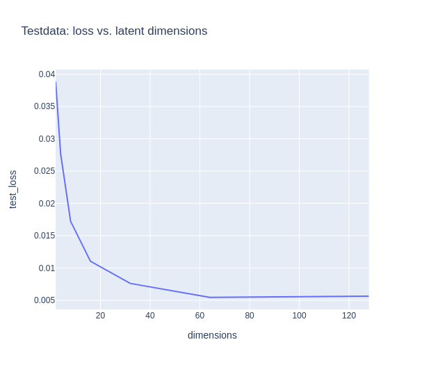
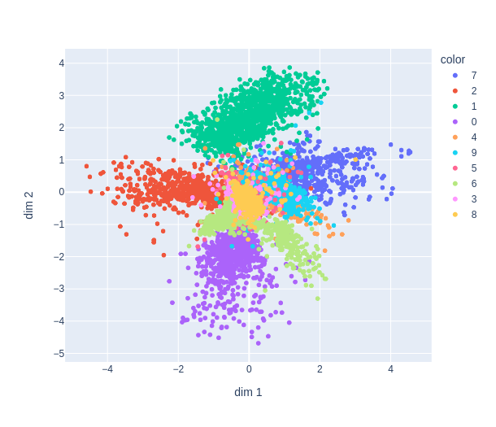
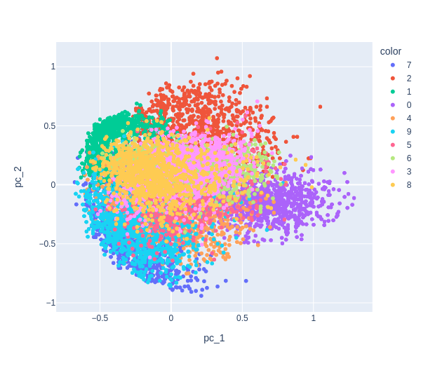
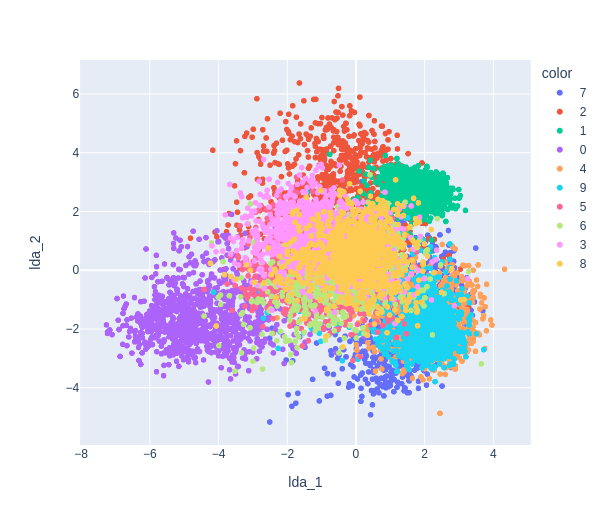
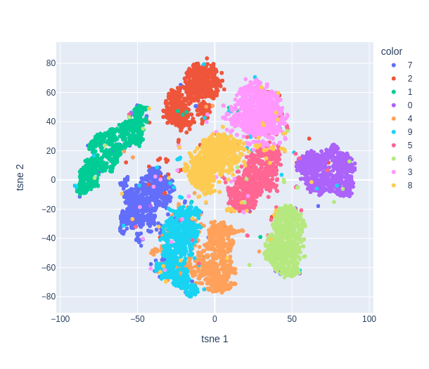
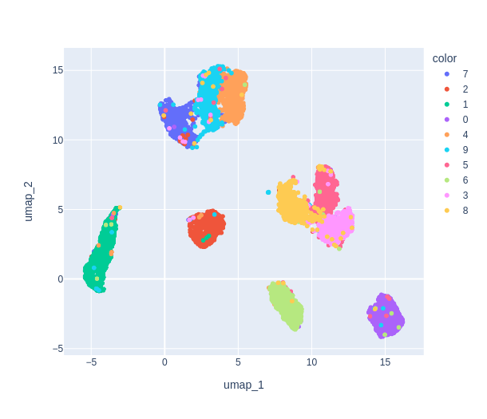

# MNIST_Digits_latent_space

Exploring different techniques for dimensionality reduction on the MNIST dataset.
The complete code can be found in the **Jupyter Notebook**.

In this noebook, I trained a model (encoder-decoder) on the MNIST digit dataset and represented the latent space in 2D. Different methods are performed:
- pca
- lda
- t-sne
- umap

### The model:

      class Encoder(nn.Module):

          def __init__(self, encoded_space_dim):
              super().__init__()

              self.encoder_cnn = nn.Sequential(
                  nn.Conv2d(1, 8, 3, stride=2, padding=1),
                  nn.BatchNorm2d(8),
                  nn.ReLU(),
                  nn.Conv2d(8, 16, 3, stride=2, padding=1),
                  nn.BatchNorm2d(16),
                  nn.ReLU(),
                  nn.Conv2d(16, 32, 3, stride=2, padding=0),
                  nn.ReLU()
              )

              ### Flatten data
              self.flatten = nn.Flatten(start_dim=1)
              ### Linear section
              self.encoder_lin = nn.Sequential(
                  nn.Linear(288, 128),
                  nn.ReLU(),
                  nn.Linear(128, encoded_space_dim)
              )
          def forward(self, x):
              x = self.encoder_cnn(x)
              x = self.flatten(x)
              x = self.encoder_lin(x)
              return x

      class Decoder(nn.Module):
          def __init__(self, encoded_space_dim):
              super().__init__()
              self.decoder_lin = nn.Sequential(
                  nn.Linear(encoded_space_dim, 128),
                  nn.ReLU(),
                  nn.Linear(128, 288), 
                  nn.ReLU()
              )

              self.unflatten = nn.Unflatten(dim=1,unflattened_size=(32, 3, 3))

              self.decoder_conv = nn.Sequential(
                  nn.ConvTranspose2d(32, 16, 3,
                                     stride=2, output_padding=0),
                  nn.BatchNorm2d(16),
                  nn.ReLU(),
                  nn.ConvTranspose2d(16, 8, 3, stride=2,
                                     padding=1, output_padding=1),
                  nn.BatchNorm2d(8),
                  nn.ReLU(),
                  nn.ConvTranspose2d(8, 1, 3, stride=2,
                                     padding=1, output_padding=1)
              )

          def forward(self, x):
              x = self.decoder_lin(x)
              x = self.unflatten(x)
              x = self.decoder_conv(x)
              x = torch.sigmoid(x)
              return x    

### Test loss

As the plot shows, 32 dimensions seem to be a good compromise for the further experiments

### Latent space of two neurons

### pca

### lda

### t-sne

### umap

